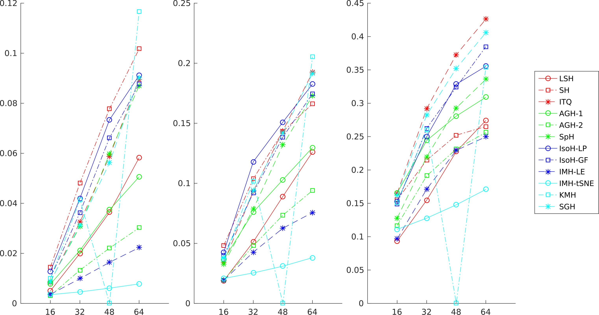
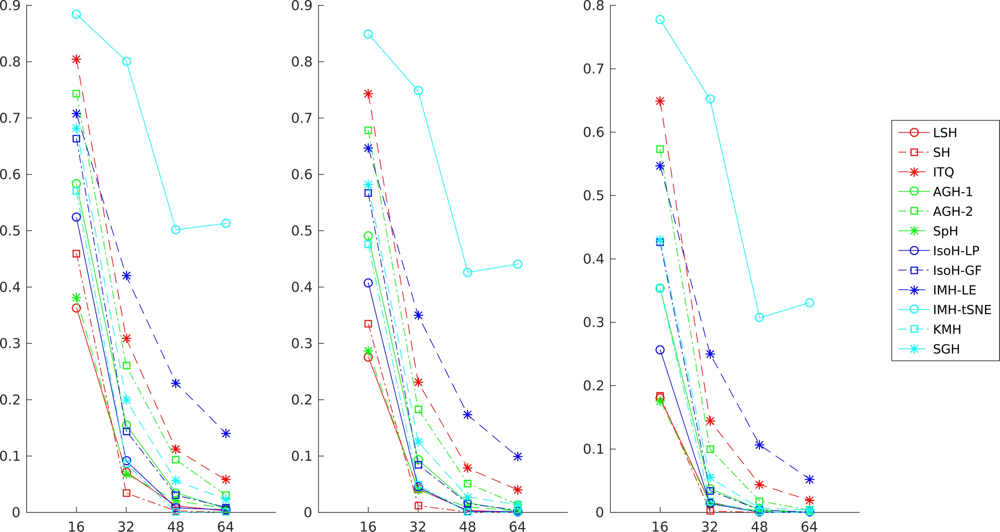

# Introduction

This project aims at intergrating popular hashing-based ANN search methods into one unified framework for more convenient performance comparison and further improvement.

We have now included the following methods:

* **LSH**: Locality Sensitive Hashing (SCG '04)
* **SH**: Spectral Hashing (NIPS '08)
* **ITQ**: Iterative Quantization (CVPR '11)
* **AGH**: Anchor Graph Hashing (ICML '11)
* **SpH**: Spherical Hashing (CVPR '12)
* **IsoH**: Isotropic Hashing (NIPS '12)
* **IMH**: Inductive Manifold Hashing (CVPR '13)
* **KMH**: K-means Hashing (CVPR '13)
* **SGH**: Scalable Graph Hashing (IJCAI '15)

Many thanks to the above methods' authors for their research and kindly provided source code.

# Evaluation Results

We evaluate all the above methods on two commonly used ANN search data sets: SIFT1M and GIST1M. For each methods, we evaluate it with two ANN search strategies:

* Hamming ranking: sort all candidates w.r.t. their Hamming distance to the query.
* Hash look-up: retrieve candidates whose Hamming distance to the query is within 2.

We report the MeanAP (Mean Average Precision) scores for Hamming ranking, and recall scores for hash look-up. For each query, the ground-truth matches are defined as its top-100/1K/10K nearest neighbors in the Euclidean space. The training process is carried out on the learning subset of each data set.

Please note: The hyper-parameters of these hashing methods are not carefully tuned. Most hyper-parameters are the same as the author's choices in their original source code, although the corresponding data sets may differ. It is possible that the MeanAP scores of some methods can be further improved.

## SIFT-1M

MeanAP scores for Hamming ranking (left: top-100 NNs; middle: top-1K NNs; right: top-10K NNs):

Recall scores for radius-2 hash look-up (left: top-100 NNs; middle: top-1K NNs; right: top-10K NNs):

## GIST-1M

To be added.
