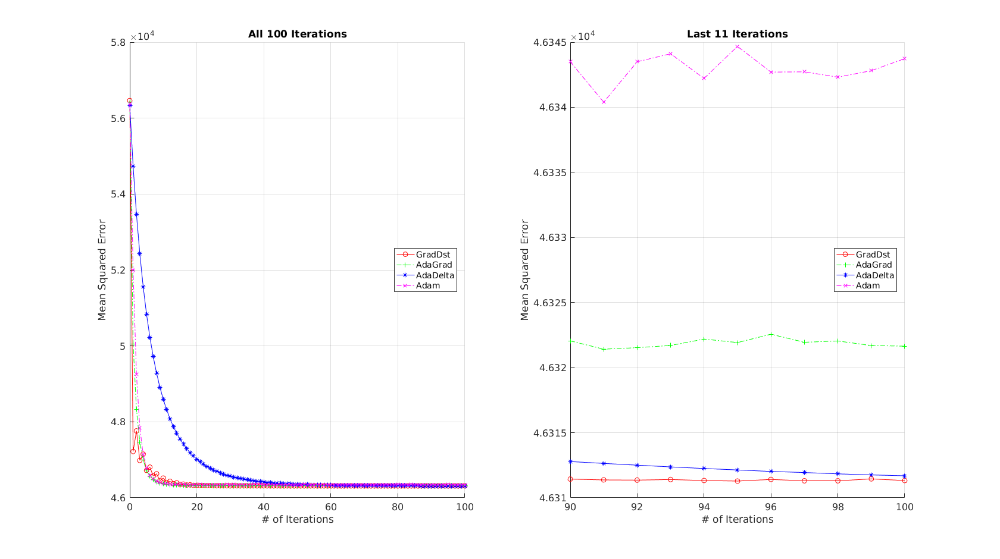

# GradOpt
A collection of gradient-based optimization methods.

In this repository, four gradient-based optimization methods are implemented, including:
* (Stochastic) Gradient Descent
* AdaGrad
* AdaDelta
* Adam

For the gradient computation, you can either rely on the whole dataset (where stochastic GD is transformed into GD), or only use a subset for faster computation and parameter update. This is controlled by the "batcSiz" option.

## Quick Start
"demo.m" provides a demonstration of how to solve a linear regression problem via the above methods. Just run it!

